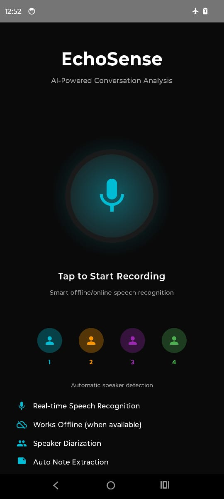
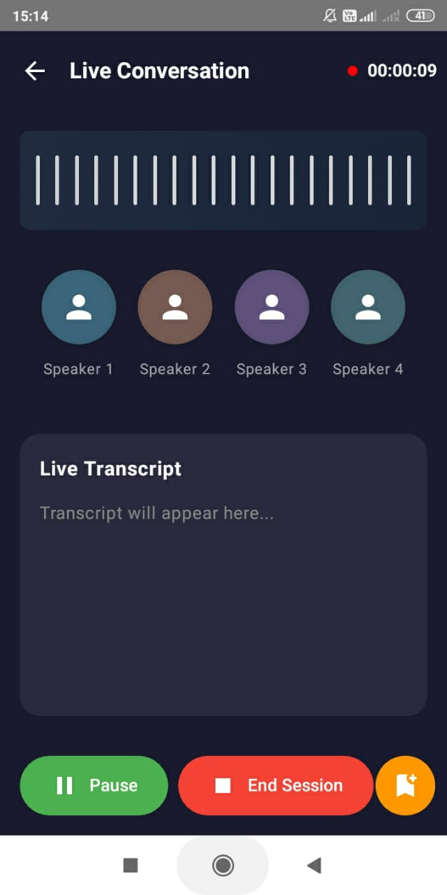

# EchoSense - Offline Conversation Companion

EchoSense is an Android application that records conversations, identifies speakers, and extracts meaningful notes - all completely offline without requiring internet connectivity.

## 🌟 Features

### 🔖 Core Functionality
- **Real-time Speaker Diarization**: Automatically identifies and tracks up to 4 different speakers in a conversation
- **Audio Recording**: High-quality audio recording with adjustable quality settings
- **Automatic Note Extraction**: Uses ML algorithms to extract:
  - Key points
  - Action items
  - Decisions made
  - Questions asked
  - Bookmarks

### 🔖 Privacy & Offline Processing
- **100% Offline**: All audio processing happens on-device
- **No Cloud Dependencies**: No data leaves your device
- **Privacy-First**: Your conversations remain completely private

### 🔖 Data Management
- **Session History**: Browse all past conversation sessions
- **Searchable Notes**: Easily find notes from past conversations
- **Multiple Export Formats**: Share as Text, PDF, or JSON
- **Bulk Export**: Export all notes at once

### 🔖 User Experience
- **Modern Material Design**: Beautiful gradient backgrounds and smooth animations
- **Dark Theme**: Easy on the eyes with AMOLED black option
- **Real-time Visualization**: See active speakers with animated indicators
- **Live Transcript**: Watch the conversation unfold in real-time

---

## 📸 UI Preview


---

---


## 🤔 How It Works

### 🏷️ Speaker Diarization
The app uses MFCC (Mel-Frequency Cepstral Coefficients) feature extraction combined with cosine similarity matching to identify different speakers:

1. **Audio Capture**: Records audio at 16kHz sample rate
2. **Feature Extraction**: Extracts MFCC features from audio segments
3. **Speaker Matching**: Compares features with existing speaker profiles
4. **Dynamic Assignment**: Creates new speaker profiles when unknown voices are detected

### 🏷️ Note Extraction
Uses rule-based NLP techniques to identify:
- **Action Items**: Detects action verbs and future tense
- **Decisions**: Identifies decision-making keywords
- **Questions**: Recognizes question patterns
- **Key Points**: Highlights important phrases and longer statements

### 🏷️ Technical Stack
- **Language**: Kotlin
- **Database**: Room (SQLite)
- **Audio Processing**: AudioRecord API
- **ML Processing**: Custom MFCC implementation
- **PDF Generation**: iText
- **Architecture**: MVVM with Coroutines

## 🛠️ Installation

### Prerequisites
- Android Studio Arctic Fox or newer
- Android SDK 24+ (Android 7.0+)
- Kotlin plugin

### Setup Steps

1. **Clone the repository** or create a new project in Android Studio

2. **Add dependencies** (already included in build.gradle):
```gradle
   implementation 'androidx.room:room-runtime:2.6.1'
   implementation 'com.itextpdf:itextpdf:5.5.13.3'
   implementation 'com.google.code.gson:gson:2.10.1'
```

3. **Grant permissions** - The app will automatically request:
   - RECORD_AUDIO
   - READ_EXTERNAL_STORAGE (Android 12 and below)
   - WRITE_EXTERNAL_STORAGE (Android 12 and below)
   - READ_MEDIA_AUDIO (Android 13+)

4. **Build and Run**
   - Connect your Android device or start an emulator
   - Click Run in Android Studio
   - The app requires a physical device for best audio recording results

## 📱 Usage

### Starting a Conversation
1. Open the app
2. Tap the large microphone button
3. The app begins recording and identifying speakers automatically
4. Speak naturally - the app handles the rest

### During Recording
- **Pause**: Temporarily pause recording
- **Add Marker**: Create a bookmark at the current timestamp
- **End Session**: Stop recording and generate summary

### After Recording
- View automatically extracted notes
- See speaker breakdown with speaking time percentages
- Read the full transcript
- Share the session in multiple formats

### Managing Notes
- Browse all notes from the Notes screen
- View full history with filters and sorting
- Share individual sessions or all notes at once
- Delete unwanted sessions

## Architecture
```
app/
├── models/          # Data models (Session, Speaker, Note, etc.)
├── db/              # Room database and DAOs
├── audio/           # Audio recording and processing
├── ml/              # Note extraction and keyword analysis
├── utils/           # Share utilities and permissions
└── activities/      # UI screens
```

### Key Components

**AudioRecorder**: Manages microphone input and PCM audio capture
**SpeakerDiarizer**: Identifies and tracks speakers using MFCC features
**NoteExtractor**: Extracts structured notes using NLP techniques
**ShareUtils**: Handles exporting to text, PDF, and JSON formats

## Limitations

### Current Limitations
- **Speaker Count**: Maximum 4 speakers per conversation
- **No Speech-to-Text**: Transcript is simulated (integrate Google Speech API or similar for production)
- **Speaker Identification**: Based on voice characteristics, not trained on specific individuals
- **Language**: Note extraction optimized for English

### Future Enhancements
- Integration with Speech-to-Text APIs
- Speaker name assignment and recognition
- Multi-language support
- Cloud backup (optional)
- Waveform visualization improvements
- Search within transcripts

## Performance

- **Memory**: ~50-100MB during active recording
- **Storage**: ~10MB per hour of audio (16kHz PCM)
- **Battery**: Optimized for extended recording sessions
- **Processing**: Real-time on mid-range devices (2019+)

## Troubleshooting

### Audio Not Recording
- Check microphone permissions in Settings
- Restart the app
- Ensure microphone is not used by another app

### Speaker Detection Not Working
- Ensure speakers are speaking clearly
- Minimize background noise
- Speakers should have distinct voice characteristics

### App Crashes
- Clear app data in Settings
- Check available storage space
- Update to latest version

## Privacy & Security

- **No Network Access**: App never requests internet permission
- **Local Storage Only**: All data stored in app's private directory
- **No Analytics**: No usage tracking or telemetry
- **Open Source**: Review the code yourself

## License

This project is provided as-is for educational and personal use.

## Contributing

Suggestions and improvements welcome! Areas for contribution:
- STT integration
- Improved speaker diarization algorithms
- UI/UX enhancements
- Multi-language support
- Additional export formats

## Credits

Built with:
- Material Design Components
- Room Persistence Library
- iText PDF
- Kotlin Coroutines

---

**EchoSense** - Your conversations, your device, your privacy.

---
#### The app uses simplified speaker diarization (MFCC + cosine similarity) that works offline. For production, you'd want to integrate a real STT service like Google Speech API or Mozilla DeepSpeech for actual transcription.
---


## 🔹 What is MFCC (Mel-Frequency Cepstral Coefficients)?

MFCCs are **numerical representations of the short-term power spectrum** of a sound signal — basically how the human ear perceives sound.

Human ears don’t respond linearly to frequency. The **Mel scale** mimics how we hear — giving more importance to frequencies below 1000 Hz.

### 🧠 MFCC Extraction Steps:

Let’s say we have a speech signal:

#### 1. **Pre-Emphasis**

Enhances high frequencies to balance the spectrum.

> Example: ( y(t) = x(t) - \alpha \cdot x(t-1) ) where ( \alpha \approx 0.95 )

#### 2. **Framing**

Speech is non-stationary, so we divide it into small frames (~20–40 ms).

#### 3. **Windowing**

Apply a window (like Hamming) to minimize edge discontinuities in each frame.

#### 4. **FFT (Fast Fourier Transform)**

Convert each frame from time domain → frequency domain.

#### 5. **Mel Filter Bank**

Apply triangular filters spaced on the **Mel scale** to simulate human hearing sensitivity.

#### 6. **Logarithm**

Take log of filter energies — mimics human perception (we perceive loudness logarithmically).

#### 7. **DCT (Discrete Cosine Transform)**

Transforms the log energies into the **cepstral domain** → gives MFCC coefficients.

> Typically, 12–13 MFCCs are kept per frame.

So, the output of this process = a vector per frame like:

```
[ -23.4, 12.6, 5.2, -1.7, 0.4, … ]
```

These vectors form the **acoustic fingerprint** of speech.

---

## 🔹 What is Cosine Similarity?

Once you have MFCC features for two audio signals, you can compare them using **cosine similarity**.

### Formula:

[
\text{Cosine Similarity} = \frac{A \cdot B}{||A|| \times ||B||}
]

Where:

* ( A ) and ( B ) are feature vectors (MFCCs)
* ( A \cdot B ) is the dot product
* ( ||A|| ) is the magnitude (length) of vector A

### Interpretation:

* **1** → signals are identical
* **0** → completely different
* **Between 0.7–0.9** → highly similar voices or sounds

---

## 🔹 How MFCC + Cosine Similarity Works in Speech Systems

Let’s see the combined workflow:

### 🎤 Step-by-Step Process:

1. **Record or Load Audio Files**
   e.g., `audio_1.wav` (reference) and `audio_2.wav` (test)

2. **Preprocess the Audio**
   Convert to mono, normalize, resample to 16 kHz, etc.

3. **Extract MFCC Features**
   Use a library like `librosa`:

   ```python
   import librosa
   import numpy as np

   y1, sr1 = librosa.load('audio1.wav', sr=16000)
   y2, sr2 = librosa.load('audio2.wav', sr=16000)

   mfcc1 = librosa.feature.mfcc(y=y1, sr=sr1, n_mfcc=13)
   mfcc2 = librosa.feature.mfcc(y=y2, sr=sr2, n_mfcc=13)

   # Take mean over time axis
   mfcc1_mean = np.mean(mfcc1, axis=1)
   mfcc2_mean = np.mean(mfcc2, axis=1)
   ```

4. **Compute Cosine Similarity**

   ```python
   from sklearn.metrics.pairwise import cosine_similarity
   similarity = cosine_similarity([mfcc1_mean], [mfcc2_mean])
   print("Similarity:", similarity[0][0])
   ```

5. **Interpret Result**

   * `~1.0`: same speaker or same word
   * `~0.5`: somewhat similar
   * `<0.3`: totally different

---

## 🔹 Applications of MFCC + Cosine Similarity

### 🗣️ 1. **Speaker Recognition**

* Identify who is speaking by comparing MFCCs of a test voice with saved voice samples.
* Example: verifying user identity in smart assistants (Alexa, Google Home).

### 🔊 2. **Speech Verification / Voice Authentication**

* Compare input voice with stored template for secure login systems.

### 🎶 3. **Music Similarity & Classification**

* Compare MFCCs to detect similar songs or genres.

### 😡 4. **Speech Emotion Recognition**

* MFCCs capture tone, pitch, and intensity, which change with emotions.
* Cosine similarity helps measure how close the emotion patterns are to labeled datasets.

### 🎬 5. **Audio Matching / Duplicate Detection**

* Detect whether two audio clips are the same even if recorded in different conditions.

### 🧏 6. **Speech-to-Speech Matching in Assistive Tech**

* Match speech patterns for pronunciation training or language learning.

---

## 🔹 Advantages

✅ Human-hearing inspired (Mel scale)
✅ Robust to noise (due to cepstral representation)
✅ Works with small data
✅ Simple & efficient — no deep learning required

---

## 🔹 Limitations

⚠️ Sensitive to background noise if not filtered properly
⚠️ Doesn’t capture temporal information (each frame treated separately)

---

## 🔹 Visualization Example

If you visualize MFCCs (using `librosa.display.specshow`), you’ll see a **heatmap-like pattern** — each color representing energy at certain frequencies over time.

Similar speakers produce **visually similar MFCC patterns**, hence cosine similarity easily measures their closeness.


